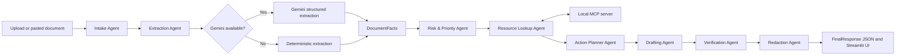

# NextStep Agent

Portfolio-quality document-to-action concierge agent for the Kaggle AI Agents Intensive Capstone.

NextStep Agent turns confusing real-world documents into safe, verified next steps with multi-agent orchestration, MCP tools, Gemini structured extraction, redaction, evaluation, and a Streamlit demo.

## Problem

People receive documents that look simple but carry hidden consequences: school notices, invoices, utility bills, appointment slips, rental maintenance notices, intake forms, fee circulars, and application deadlines. The user needs to know what matters, what to do next, when it is due, what risk exists, and what information should not be exposed.

## Demo Flow

```powershell
python -m nextstep_agent.agent examples/sample_school_notice.txt --current-date 2026-07-02 --trace
python -m nextstep_agent.agent examples/sample_invoice.txt --current-date 2026-07-02 --json
python evals/run_evals.py
streamlit run app.py
```

Optional Gemini extraction:

```powershell
python -m nextstep_agent.agent examples/sample_school_notice.txt --current-date 2026-07-02 --use-gemini --trace
```

Image input requires Gemini:

```powershell
python -m nextstep_agent.agent path/to/document.png --use-gemini --trace
```

## Architecture



## Agents

- Intake Agent: normalizes uploaded or pasted text.
- Extraction Agent: extracts typed facts with heuristics or Gemini.
- Risk & Priority Agent: calculates deadline urgency and consequences.
- Resource Lookup Agent: calls local MCP tools for guidance and templates.
- Action Planner Agent: creates prioritized source-backed actions.
- Drafting Agent: writes a cautious response or checklist.
- Verification Agent: checks grounding and unsafe claims.
- Redaction Agent: removes sensitive data from final output.

## MCP Tools

`mcp_server/server.py` exposes:

- `policy_lookup(query, category)`
- `template_fetch(intent)`
- `deadline_calculator(date_text, current_date)`
- `task_store(action_items, session_id)`
- `safety_boundary_check(output)`

The CLI and app show why each MCP tool was called.

## Security And Redaction

NextStep Agent redacts:

- Email addresses.
- Phone numbers.
- Account-like long numbers.
- 12 digit ID-like sequences without claiming official validation.
- Simple addresses.
- Labeled account, invoice, student, patient, client, tenant, meter, and policy identifiers.
- Labeled names.

The verifier rejects unsupported payment, legal, or medical claims. The app warns that it provides organizational help only, not legal, medical, or financial advice.

## Evaluation Results

```powershell
python evals/run_evals.py
```

Current deterministic result:

- Total cases: 10.
- Passed cases: 10.
- Failed cases: 0.
- Score: 80/80.

The suite covers school, invoice, utility, appointment, NGO intake, rental maintenance, internship, medical appointment, small business order, and scholarship or college fee circular scenarios.

## Setup

```powershell
python -m venv .venv
.\.venv\Scripts\Activate.ps1
pip install -r requirements.txt
```

## Gemini Setup

Gemini is optional. Without an API key, text documents use deterministic extraction.

Create `.env` from `.env.example`:

```powershell
GOOGLE_API_KEY=your_key_here
NEXTSTEP_MODEL=gemini-flash-latest
```

Do not commit `.env` or `.streamlit/secrets.toml`.

## Streamlit Demo

```powershell
streamlit run app.py
```

The app includes:

- Sample document dropdown.
- Text area.
- File uploader for `.txt`, `.md`, `.pdf`, `.png`, `.jpg`, and `.jpeg`.
- Gemini toggle.
- Agent trace.
- Extracted facts, risk, MCP calls, next-step plan, draft/checklist, verification, redacted output, and saved tasks.

## Deployment

Streamlit Community Cloud deployment is documented in `docs/deployment.md`.

Short version:

1. Push the repo to GitHub.
2. Create a Streamlit Community Cloud app with `app.py` as the entrypoint.
3. Add `GOOGLE_API_KEY` and `NEXTSTEP_MODEL` in Advanced settings if Gemini is desired.
4. Deploy.

The app still works in fallback mode without `GOOGLE_API_KEY`.

## Competition Alignment

| Requirement / concept | Where demonstrated | File or demo proof |
| --- | --- | --- |
| Multi-agent system | Eight named stages and trace output | `nextstep_agent/agent.py`, `--trace` |
| Google ADK alignment | ADK-compatible agent construction with local fallback | `nextstep_agent/agent.py` |
| Gemini structured extraction | Optional text and image extraction path | `nextstep_agent/gemini_client.py`, `--use-gemini` |
| MCP tool usage | Local MCP server and visible tool calls | `mcp_server/server.py`, `metadata.mcp_calls` |
| Security/redaction | Redaction and verifier gates | `nextstep_agent/redaction.py`, `nextstep_agent/verifier.py` |
| Deployability | Streamlit app, config, secrets example, deployment guide | `app.py`, `.streamlit/`, `docs/deployment.md` |
| Agent skills | Clear specialized responsibilities | `nextstep_agent/prompts.py`, `docs/architecture.md` |
| Evaluation discipline | Ten deterministic fixtures and markdown report | `evals/cases.json`, `evals/run_evals.py` |
| Demo/video proof | Generated snapshots and timed script | `docs/demo_outputs/`, `docs/demo_script.md` |

## Repository Structure

```text
nextstep_agent/       Core agent pipeline, schemas, redaction, Gemini, loaders
mcp_server/           Local MCP server tools
data/                 Templates, resource pack, runtime task store path
examples/             Demo text documents
evals/                Evaluation fixtures and runner
docs/                 Architecture, deployment, demo script, writeup, snapshots
tests/                Unit and pipeline tests
app.py                Streamlit demo
```

## Limitations

- Image extraction requires Gemini and an API key.
- Text-based PDFs work through `pypdf`; scanned PDFs need Gemini/image handling or future OCR.
- Local JSONL task storage is demo-grade, not multi-user production storage.
- Heuristic extraction is conservative and does not replace human review.
- The tool gives organizational help only.

## Future Work

- Add hosted database storage.
- Add multilingual and OCR-focused evals.
- Add Gemini-vs-heuristic scoring.
- Add richer ADK runner orchestration.
- Package a deployed public demo URL for final submission.
