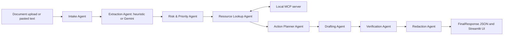

# NextStep Agent

NextStep Agent is a multimodal-ready document-to-action concierge agent for the Kaggle AI Agents Intensive Capstone. It turns confusing notices, invoices, bills, appointment slips, and intake forms into safe, verified next steps.

Phase 1.1 adds an optional live Gemini extraction path, upload-ready Streamlit demo, structured output metadata, evaluation fixtures, and stronger redaction while preserving the deterministic local pipeline.

## Problem

Everyday documents often hide the action a person needs to take: pay by a date, bring a form, respond to a school, avoid utility interruption, or submit intake proof. Missing one detail can mean fees, missed appointments, service disruption, or unnecessary exposure of sensitive information.

## Why Agents Are Needed

A single prompt is brittle for this workflow. NextStep Agent separates the job into specialist agents so each stage has a clear contract:

- Extract source facts.
- Calculate deadlines.
- Assess risk.
- Look up local policies and templates through MCP tools.
- Plan actions.
- Draft a safe response.
- Verify the draft against source evidence.
- Redact sensitive output.

## Architecture



Agent definitions and instructions live in `nextstep_agent/prompts.py` and `nextstep_agent/agent.py`.

## MCP Tools

The local MCP server in `mcp_server/server.py` exposes real callable tools:

- `policy_lookup(query, category)` finds local resource guidance.
- `template_fetch(intent)` returns a safe response template.
- `deadline_calculator(date_text, current_date)` normalizes dates and urgency.
- `task_store(action_items)` records planned tasks in an in-memory local sink.
- `safety_boundary_check(output)` checks for unsafe wording or unredacted sensitive data.

The CLI and Streamlit demo show the MCP calls and why they were used.

## Security And Redaction

Redaction is a required pipeline stage. The project detects and removes:

- Email addresses.
- Phone numbers.
- Labeled account, invoice, student, patient, client, meter, and policy identifiers.
- Account-like long numbers.
- Aadhaar-style 12 digit sequences without claiming official Aadhaar validation.
- Simple street addresses.
- Labeled personal names.

The verifier checks drafts for unsupported claims and unredacted sensitive data before final output.

## Setup

```powershell
python -m venv .venv
.\.venv\Scripts\Activate.ps1
pip install -r requirements.txt
```

## Gemini Setup

Gemini is optional. The system runs without an API key and falls back to deterministic extraction.

Create `.env` from `.env.example`:

```powershell
GOOGLE_API_KEY=your_key_here
NEXTSTEP_MODEL=gemini-flash-latest
```

Do not commit `.env`.

## CLI Demo Commands

Deterministic trace:

```powershell
python -m nextstep_agent.agent examples/sample_school_notice.txt --current-date 2026-07-02 --trace
```

JSON output:

```powershell
python -m nextstep_agent.agent examples/sample_invoice.txt --current-date 2026-07-02 --json
```

Compact JSON:

```powershell
python -m nextstep_agent.agent examples/sample_utility_bill.txt --current-date 2026-07-02 --compact
```

Gemini-backed extraction when an API key is available:

```powershell
python -m nextstep_agent.agent examples/sample_school_notice.txt --current-date 2026-07-02 --use-gemini --trace
```

Direct pasted text:

```powershell
python -m nextstep_agent.agent --text "Payment due by July 12, 2026. Account Number: 1234567890." --current-date 2026-07-02 --json
```

## Streamlit Demo

```powershell
streamlit run app.py
```

The app supports pasted text and `.txt`, `.md`, or text-based `.pdf` uploads. Image OCR is documented as a later-phase extension.

## Evaluation

```powershell
python evals/run_evals.py
```

The fixture suite covers school, invoice, utility bill, appointment slip, and NGO intake scenarios.

## Antigravity Demo Readiness

The repository is ready for an Antigravity-style demo walkthrough: run the CLI trace, run Streamlit, show MCP calls, show redaction, then run the evaluation suite. Antigravity is not required for runtime.

## Competition Alignment

| Requirement / concept | Where demonstrated | File or demo proof |
| --- | --- | --- |
| Agent / multi-agent system | Eight named specialist agents and stage trace | `nextstep_agent/agent.py`, `nextstep_agent/prompts.py`, `--trace` |
| Google ADK orientation | ADK-compatible agent construction with fallback local definitions | `nextstep_agent/agent.py` |
| Gemini live path | Optional structured extraction with safe fallback | `nextstep_agent/gemini_client.py`, `--use-gemini` |
| MCP tool usage | Local MCP server and visible MCP trace | `mcp_server/server.py`, `metadata.mcp_calls` |
| Security and redaction | Required redaction stage and verifier checks | `nextstep_agent/redaction.py`, `nextstep_agent/verifier.py` |
| Structured outputs | Pydantic schemas and JSON CLI output | `nextstep_agent/schemas.py`, `--json` |
| Upload-ready demo | Streamlit file uploader and pasted text area | `app.py` |
| Evaluation/tests | Unit tests and fixture eval runner | `tests/`, `evals/run_evals.py` |
| Deployability | No hardcoded secrets, env-based config, local commands | `.env.example`, `requirements.txt` |
| Agent skills | Clear agent responsibilities and prompts | `docs/architecture.md`, `nextstep_agent/prompts.py` |
| Antigravity demo-readiness | Scripted trace/demo flow without runtime dependency | `docs/demo_script.md` |

## Limitations

- Gemini extraction requires a valid `GOOGLE_API_KEY`; otherwise deterministic heuristics are used.
- The Streamlit app supports text-based PDFs only when `pypdf` can extract text.
- Image OCR and scanned document handling are planned for a later phase.
- Extraction heuristics are intentionally conservative and not production-grade.
- Drafts are informational and should be reviewed by a human before sending.
