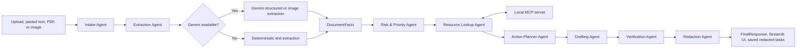

# NextStep Agent

Turn confusing real-world documents into safe, verified next steps.

## What It Does

NextStep Agent is a multimodal document-to-action concierge for school notices, invoices, utility bills, appointment slips, small-business notices, and intake forms. A user pastes or uploads a document, and the system extracts key facts, detects deadlines, checks risk, uses local MCP tools, creates a prioritized next-step plan, drafts a cautious response or checklist, verifies the draft against the source, redacts sensitive information, and saves redacted tasks locally.

## Why It Matters

- People miss deadlines because important actions are buried inside everyday documents.
- A single chatbot response can be hard to inspect, verify, or safely reuse.
- NextStep Agent makes the workflow traceable: agents, tools, risk checks, verification, redaction, and evaluations are visible.

## Public Demo

Streamlit Community Cloud demo:

```text
PASTE_STREAMLIT_URL_HERE
```

Recommended screenshot: Streamlit app with the school notice sample, agent trace, MCP tool calls, redaction panel, and action plan visible.

## Quick Demo Commands

```powershell
python -m nextstep_agent.agent demo_pack/demo_school_notice.txt --current-date 2026-07-02 --trace
python -m nextstep_agent.agent demo_pack/demo_invoice.txt --current-date 2026-07-02 --json
python evals/run_evals.py
```

## Streamlit Demo

```powershell
streamlit run app.py
```

The app can be run locally and deployed on Streamlit Community Cloud. It includes sample selection, paste/upload input, optional Gemini mode, agent trace, extracted facts, risk assessment, MCP calls, next steps, draft/checklist, verification, redacted output, and saved task metadata.

## Evaluation Result

10/10 eval scenarios passed, 80/80 deterministic score.

## Competition Alignment

| Competition priority | How NextStep Agent addresses it | Proof |
| --- | --- | --- |
| Track: Concierge Agents | Helps users complete a practical document-to-action workflow | CLI, Streamlit app, demo pack |
| Multi-agent architecture | Eight named stages with typed handoffs and trace output | `nextstep_agent/agent.py`, `docs/architecture.md` |
| Google ADK alignment | ADK-compatible agent definitions with deterministic local execution | `build_adk_agents()` in `nextstep_agent/agent.py` |
| Gemini usage | Optional structured extraction for text and optional multimodal image extraction | `nextstep_agent/gemini_client.py` |
| MCP usage | Local tools for policy lookup, templates, deadlines, task storage, and safety checks | `mcp_server/server.py`, trace metadata |
| Security and redaction | Redaction stage, safety boundary checks, verifier gates, ignored task store | `nextstep_agent/redaction.py`, `nextstep_agent/verifier.py`, `.gitignore` |
| Evaluation | 10 deterministic cases covering varied document scenarios | `evals/cases.json`, `evals/run_evals.py` |
| Demo readiness | Streamlit UI, demo docs, video script, media prompts, release checklist | `app.py`, `docs/demo_script.md`, `SUBMISSION_CHECKLIST.md` |

## For Judges

### 60-Second Review Path

1. Read the top of this README.
2. Scan the competition alignment table.
3. Run `python evals/run_evals.py` and confirm `10 passed, 0 failed, 80/80`.
4. Open the public demo at `PASTE_STREAMLIT_URL_HERE` or run the school notice trace command locally.

### 5-Minute Review Path

1. Start Streamlit with `streamlit run app.py`.
2. Choose the sample school notice.
3. Review the agent trace, MCP tool calls, risk assessment, redaction, and saved task metadata.
4. Run the invoice JSON command to inspect the typed `FinalResponse`.
5. Open `docs/demo_script.md` for the intended video walkthrough.

### Deep Technical Review Path

1. Read `docs/architecture.md`.
2. Inspect the Pydantic contracts in `nextstep_agent/schemas.py`.
3. Inspect the pipeline in `nextstep_agent/agent.py`.
4. Inspect MCP tool implementations in `mcp_server/server.py`.
5. Review `evals/cases.json`, `evals/run_evals.py`, and tests in `tests/`.
6. Run `python scripts/final_qa.py`.

## Safety And Scope

NextStep Agent provides organizational assistance only. It is not legal, medical, financial, tax, or professional advice. The final draft is intended for user review before sending.

No API keys or secrets are committed. `.env`, `.streamlit/secrets.toml`, and `data/tasks.jsonl` are ignored by git.

Gemini is optional. Text demos, tests, and deterministic evals work without an API key. If `GOOGLE_API_KEY` is configured, Gemini can improve structured extraction and enable image input. Image and scanned-document extraction are gracefully gated when Gemini is unavailable.

## Setup

```powershell
python -m venv .venv
.\.venv\Scripts\Activate.ps1
pip install -r requirements.txt
```

On macOS or Linux:

```bash
python -m venv .venv
source .venv/bin/activate
pip install -r requirements.txt
```

## Optional Gemini Setup

Create `.env` from `.env.example`:

```powershell
GOOGLE_API_KEY=your_key_here
NEXTSTEP_MODEL=gemini-flash-latest
```

For Streamlit Community Cloud, add the same values in app secrets. Do not commit `.env` or `.streamlit/secrets.toml`.

Optional Gemini text extraction:

```powershell
python -m nextstep_agent.agent demo_pack/demo_school_notice.txt --current-date 2026-07-02 --use-gemini --trace
```

Optional image extraction:

```powershell
python -m nextstep_agent.agent path/to/document.png --current-date 2026-07-02 --use-gemini --trace
```

## Architecture



## Agent Stages

- Intake Agent: normalizes uploaded or pasted input.
- Extraction Agent: extracts typed facts with deterministic rules or Gemini.
- Risk & Priority Agent: calculates urgency and consequences.
- Resource Lookup Agent: calls local MCP tools for guidance and templates.
- Action Planner Agent: creates prioritized, source-backed actions.
- Drafting Agent: writes a cautious response or checklist.
- Verification Agent: checks grounding and unsafe claims.
- Redaction Agent: removes sensitive data from final output.

## MCP Tools

`mcp_server/server.py` exposes:

- `policy_lookup(query, category)`
- `template_fetch(intent)`
- `deadline_calculator(date_text, current_date)`
- `task_store(action_items, session_id)`
- `safety_boundary_check(output)`

The CLI and app show why each MCP tool was called.

## Demo Pack

The `demo_pack/` directory contains fictional, safe documents for recording and live demos:

- `demo_school_notice.txt`
- `demo_invoice.txt`
- `demo_utility_bill.txt`
- `demo_internship_deadline.txt`

The `examples/` directory contains the original sample documents used during development.

## Evaluation

```powershell
python evals/run_evals.py
python -m pytest -q
```

Current deterministic result:

- Total cases: 10.
- Passed cases: 10.
- Failed cases: 0.
- Score: 80/80.

The suite covers school, invoice, utility, appointment, NGO intake, rental maintenance, internship, medical appointment, small business order, and scholarship or college fee circular scenarios.

## Deployment

Deployment is documented in `docs/deployment.md`.

Public demo:

```text
PASTE_STREAMLIT_URL_HERE
```

The deployed app uses Streamlit Community Cloud. `GOOGLE_API_KEY`, if available, is configured only through Streamlit secrets and is not committed to this repository.

## Repository Structure

```text
nextstep_agent/       Core agent pipeline, schemas, redaction, Gemini, loaders
mcp_server/           Local MCP server tools
data/                 Templates, resource pack, ignored runtime task store path
demo_pack/            Fictional demo documents for final recording
examples/             Development sample text documents
evals/                Evaluation fixtures and runner
docs/                 Architecture, deployment, demo script, writeup, media prompts
scripts/              Final QA runner
tests/                Unit and pipeline tests
app.py                Streamlit demo
```

## Limitations

- Image extraction requires Gemini and an API key.
- Text-based PDFs work through `pypdf`; scanned PDFs need Gemini image handling or future OCR.
- Local JSONL task storage is demo-grade, not hosted multi-user storage.
- Deterministic extraction is conservative and may miss unusual wording.
- The tool provides organizational assistance only and requires human review.

## Release Candidate Materials

- `SUBMISSION_CHECKLIST.md`
- `RELEASE_NOTES.md`
- `docs/kaggle_writeup_draft.md`
- `docs/demo_script.md`
- `docs/video_shot_list.md`
- `docs/media_assets.md`
- `docs/gemini_live_comparison.md`
