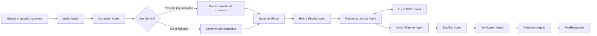

# Architecture

NextStep Agent is organized as a staged multi-agent workflow. Each stage has a small responsibility and exchanges typed Pydantic data.



## Agents

`Intake Agent` normalizes input from pasted text, `.txt`, `.md`, or text-based `.pdf` documents.

`Extraction Agent` creates `DocumentFacts` with either deterministic heuristics or optional Gemini structured output.

`Risk & Priority Agent` calls `deadline_calculator` and assigns low, medium, or high risk.

`Resource Lookup Agent` calls MCP tools for local guidance and templates.

`Action Planner Agent` converts source facts into prioritized `ActionItem` records.

`Drafting Agent` creates a cautious response and checklist.

`Verification Agent` checks the plan and draft against source evidence and safety boundaries.

`Redaction Agent` removes sensitive fields before presentation.

## Data Contracts

The core schemas are in `nextstep_agent/schemas.py`:

- `DocumentFacts`
- `RiskAssessment`
- `ActionItem`
- `ActionPlan`
- `DraftOutput`
- `VerificationReport`
- `FinalResponse`

`FinalResponse.metadata` stores the trace, extraction mode, MCP call details, and current date.

## MCP Server

`mcp_server/server.py` exposes a local MCP server over stdio:

```powershell
python -m mcp_server.server
```

The deterministic CLI calls the same Python functions directly, while the MCP server remains available for ADK or MCP-compatible clients.

## Gemini Path

`nextstep_agent/gemini_client.py` loads configuration from environment variables or `.env`, requests JSON structured output, validates it with Pydantic, and falls back to heuristics if the API key is missing, the SDK is unavailable, the request fails, or malformed JSON is returned.

## Upload Path

`nextstep_agent/document_loader.py` supports `.txt`, `.md`, and optional text-based `.pdf` extraction with `pypdf`. Image OCR remains a later-phase extension.

## Security Boundary

Source documents can contain sensitive fields, but final display passes through redaction and verification. The redaction layer covers contact details, account-like numbers, 12 digit ID-like sequences, addresses, labeled names, and common identifiers.
