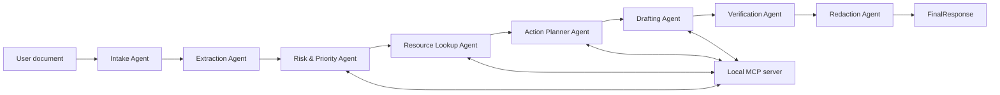

# Architecture

NextStep Agent uses a staged multi-agent workflow. Phase 1 runs deterministically from the CLI, while preserving the boundaries needed to move each stage into Google ADK agents.



## Agent Responsibilities

`Intake Agent` normalizes uploaded or pasted document text and prepares it for extraction.

`Extraction Agent` identifies document type, sender, recipient, dates, deadlines, amounts, identifiers, required actions, contact methods, and sensitive fields.

`Risk & Priority Agent` detects urgency, missed deadlines, financial or service interruption risk, school or minor context, and human review requirements.

`Resource Lookup Agent` calls the MCP server for relevant policy notes and response templates.

`Action Planner Agent` converts facts and risk into prioritized `ActionItem` records.

`Drafting Agent` creates a safe response and checklist grounded in the source document and selected template.

`Verification Agent` checks whether the plan and draft stay aligned with source evidence.

`Redaction Agent` removes sensitive fields before presenting user-facing output.

## MCP Server

The local MCP server lives in `mcp_server/server.py`. It exposes real callable tools and can run over stdio with:

```powershell
python -m mcp_server.server
```

The CLI calls the same functions directly so the Phase 1 demo works even when no ADK runner is configured.

## Data Contracts

The Pydantic schemas in `nextstep_agent/schemas.py` define the public data model:

- `DocumentFacts`
- `RiskAssessment`
- `ActionItem`
- `ActionPlan`
- `DraftOutput`
- `VerificationReport`
- `FinalResponse`

These schemas keep agent handoffs explicit and testable.

## Security Boundary

The project treats redaction and verification as required stages, not display-only features. Source text can contain sensitive fields, but final CLI output is passed through the redaction layer. The MCP `safety_boundary_check` also detects sensitive content and unsafe wording before final presentation.

## Future Phase Hooks

Later phases can replace deterministic functions with model-backed ADK agents, add OCR or multimodal input, persist tasks to a database, and add a larger evaluation set without changing the core handoff schemas.
