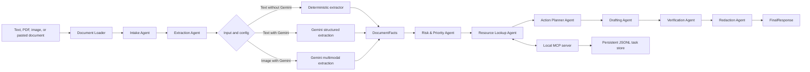

# Architecture

NextStep Agent is a staged multi-agent workflow with typed handoffs, local MCP tools, optional Gemini extraction, persistent task storage, and visible safety controls.

## Agent Responsibilities

`Intake Agent` normalizes the document payload and records trace metadata.

`Extraction Agent` creates `DocumentFacts`. Text can use deterministic extraction or Gemini structured output. Image input requires Gemini because local OCR dependencies are intentionally out of scope.

`Risk & Priority Agent` calls `deadline_calculator`, checks urgency, and flags consequences such as payment, service interruption, student context, or scheduled appointments.

`Resource Lookup Agent` calls `policy_lookup` and `template_fetch` to ground the plan in local guidance.

`Action Planner Agent` converts facts and risk into prioritized `ActionItem` records.

`Drafting Agent` creates a cautious response and checklist.

`Verification Agent` checks evidence support and unsafe claims.

`Redaction Agent` sanitizes final presentation.

## MCP Tools

The MCP server in `mcp_server/server.py` exposes:

- `policy_lookup`
- `template_fetch`
- `deadline_calculator`
- `task_store`
- `safety_boundary_check`

`task_store` persists redacted action records to `data/tasks.jsonl` with a run/session id. The runtime file is ignored by git.

## Data Contracts

The pipeline exchanges Pydantic models:

- `DocumentFacts`
- `RiskAssessment`
- `ActionItem`
- `ActionPlan`
- `DraftOutput`
- `VerificationReport`
- `FinalResponse`

`FinalResponse.metadata` includes:

- Current date.
- Session id.
- Extraction mode.
- Stage trace.
- MCP call details.
- Saved task count and task store path.

## Input Handling

`nextstep_agent/document_loader.py` supports:

- `.txt`
- `.md`
- text-based `.pdf` through `pypdf`
- `.png`, `.jpg`, and `.jpeg` only when Gemini is enabled

If a PDF dependency is missing or image OCR is requested without Gemini, the CLI and app show clear messages.

## Security Boundary

Security is implemented as an active stage:

- Redaction removes contact details, account-like numbers, 12 digit ID-like values, simple addresses, identifiers, and labeled names.
- Verification rejects unsupported payment, legal, and medical claims.
- The app warns users that the project provides organizational help only.

## Deployment Shape

The Streamlit app is the deployment target. It reads secrets from Streamlit secrets or local environment variables. Without `GOOGLE_API_KEY`, deterministic text extraction remains available.
